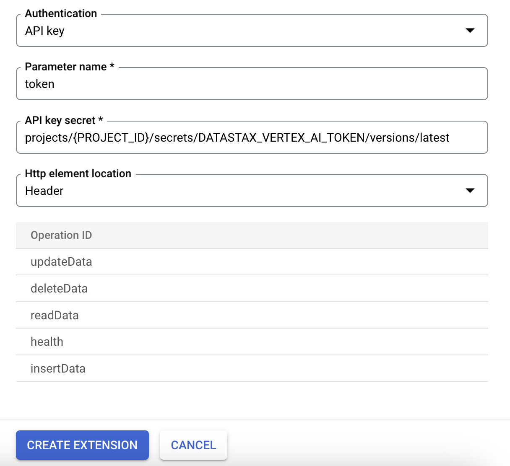

# Astra DB Vertex AI Extension

The Astra DB Vertex AI Extension allows users to perform CRUD operations against their Astra databases using natural language. The supported operations are:

- readData
- insertData
- updateData
- deleteData

## Installation

Follow the steps below to register this extension against your Astra DB instance.

### Prerequisites

The steps on this page assume the following:

- You have an active [Vertex account](https://cloud.google.com/vertex-ai/) account.
- You have an active [Astra account](https://astra.datastax.com/signup) with:
  - An [Astra Serverless (Vector) database](https://docs.datastax.com/en/astra/astra-db-vector/databases/create-database.html#create-vector-database).
  - An [Astra application token](https://docs.datastax.com/en/astra/astra-db-vector/administration/manage-application-tokens.html) with the [database administrator role](https://docs.datastax.com/en/astra/astra-db-vector/administration/manage-database-access.html).
  - Vector data populated in your database. [Sample data sets](https://docs.datastax.com/en/astra/astra-db-vector/databases/load-data.html#load-sample-vector-data) are available.
- You have a Google Cloud project with:
  - The Vertex API enabled. For more, see [Get set up on Google Cloud](https://cloud.google.com/vertex-ai/docs/start/cloud-environment).
  - The Vertex AI Administrator (`roles/aiplatform.admin`) or Vertex AI User (`roles/aiplatform.user`) roles assigned to users or service accounts in your project. For more, see [Vertex AI access control with IAM](https://cloud.google.com/vertex-ai/docs/general/access-control).

### Initial Steps

1. Clone the repository:

    ```bash
    git clone git@github.com:riptano/vertex-ai-extension.git
    ```

2. In the <a href="https://console.cloud.google.com/security/secret-manager" target="_blank">Google Secrets Manager</a>, create a secret for your **Astra DB Credentials**, named `DATASTAX_VERTEX_AI_TOKEN`, the format of which is as follows: `<ASTRA_DB_APPLICATION_TOKEN>;<ASTRA_DB_API_ENDPOINT>;<ASTRA_DB_TABLE>`. **These values can be found in your Astra DB Portal after creating a database. See the above documentation links for more information**
3. Grant permissions on this secret to the required principal, i.e., your own account if registering the extension manually or the appropriate service account
4. Next, choose either a UI or Python-based method of registering the extension

### Using the Vertex AI Extension UI

1. Browse to the <a href="https://console.cloud.google.com/vertex-ai/extensions" target="_blank">Vertex AI Extensions Page</a>
2. Click `Create Extension`
3. Fill in the fields of the form, choosing `extension.yaml` from the `astra-crud-extension-api` as your OpenAPI spec. See screenshots for example values.




### Using the Python SDK

1. If you have not already, ensure that you have authenticated with Google Cloud `gcloud auth login`
2. If you have not already, ensure that you have set your project id with `gcloud config set project [PROJECT_ID]`
3. Download and install the Vertex AI Python SDK with `pip install google-cloud-aiplatform`
4. Copy the `extension.yaml` file in the `astra-crud-extension-api` folder to the GCS bucket and folder of your choice, such as `gs://[BUCKET_NAME]/[EXTENSION_PATH]/extension.yaml`.
5. Register your extension using the Python SDK, substituting `[BUCKET_NAME]` and `[EXTENSION_PATH]` as appropriate:

    ```python
    from google.cloud.aiplatform.private_preview import llm_extension
  
    PROJECT_ID = "[PROJECT_ID]"
    SECRET_ID = "DATASTAX_VERTEX_AI_TOKEN"
    BUCKET_NAME = "[BUCKET_NAME]"
    EXTENSION_PATH = "[EXTENSION_PATH]"
    
    extension_astra = llm_extension.Extension.create(
        display_name = "Perform a CRUD Operation on Astra DB",
        description = "Inserts, loads, updates, or deletes data from Astra DB and returns it to the user",
        manifest = {
            "name": "astra_tool",
            "description": "Access and process data from AstraDB",
            "api_spec": {
                "open_api_gcs_uri": f"gs://{BUCKET_NAME}/{EXTENSION_PATH}/extension.yaml"
            },
            "authConfig": {
                "authType": "API_KEY_AUTH",
                "apiKeyConfig": {
                    "name": "token",
                    "apiKeySecret": f"projects/{PROJECT_ID}/secrets/{SECRET_ID}/versions/1",
                    "httpElementLocation": "HTTP_IN_HEADER",
                },
            }
        },
    )
    
    extension_astra
    ```

6. Confirm extension has been successfully created at the <a href='https://console.cloud.google.com/vertex-ai/extensions' target='_blank'>Extensions Page</a>

## Running your Extension

You can now run your extension, either testing from the Vertex AI Extensions UI, or via Python like so:

```python
extension_astra.execute("health", operation_params={})
extension_astra.execute("readData",
    operation_params = {},
)
```

## For Astra Developers

Use of the extension requires a deployed cloud run container.

1. If you have not already, ensure that you have authenticated with Google Cloud `gcloud auth login`
2. If you have not already, ensure that you have set your project id with `gcloud config set project [PROJECT_ID]`
3. To build the container, run `docker build --platform linux/amd64 -t gcr.io/[PROJECT_ID]/astra-crud astra-crud-extension`
4. To push the image, run `docker push gcr.io/[PROJECT_ID]/astra-crud`
5. Register the container artifact in <a href='https://console.cloud.google.com/run/create' target='_blank'>Cloud Run</a>
